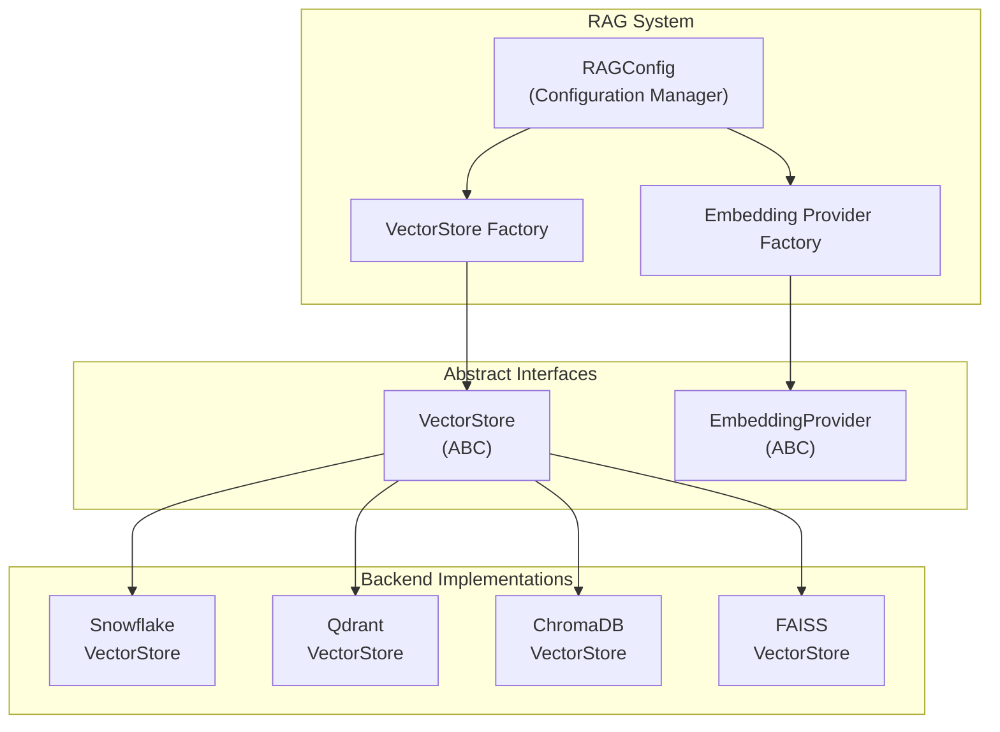
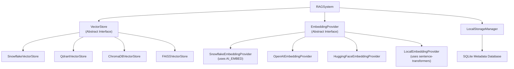
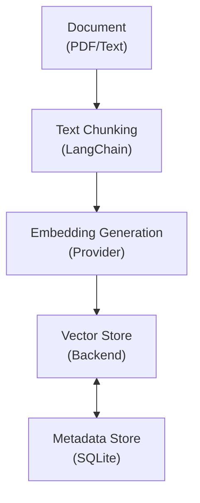
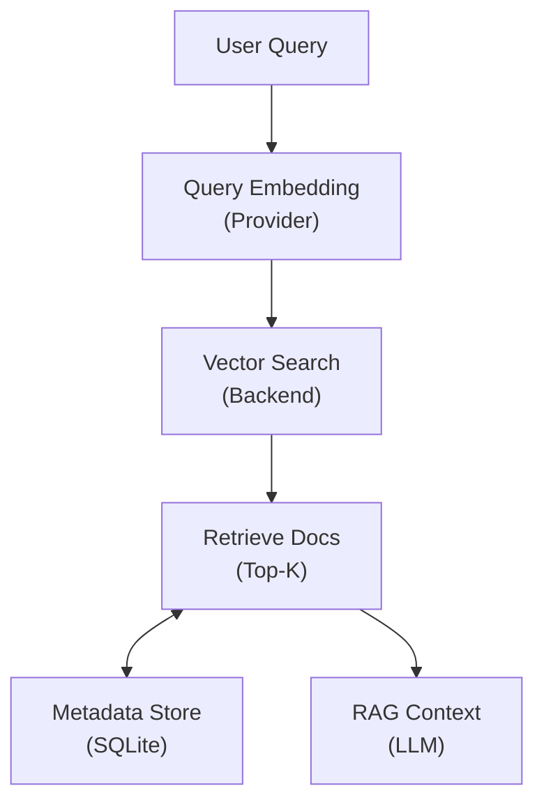
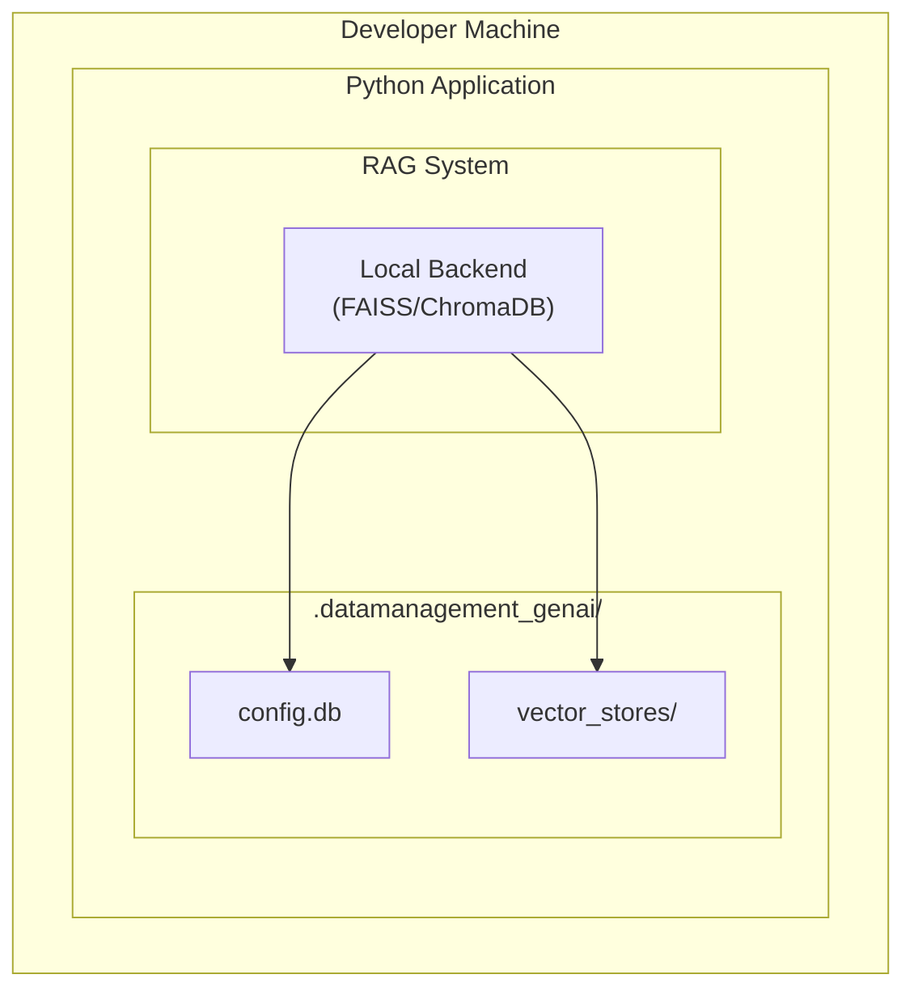
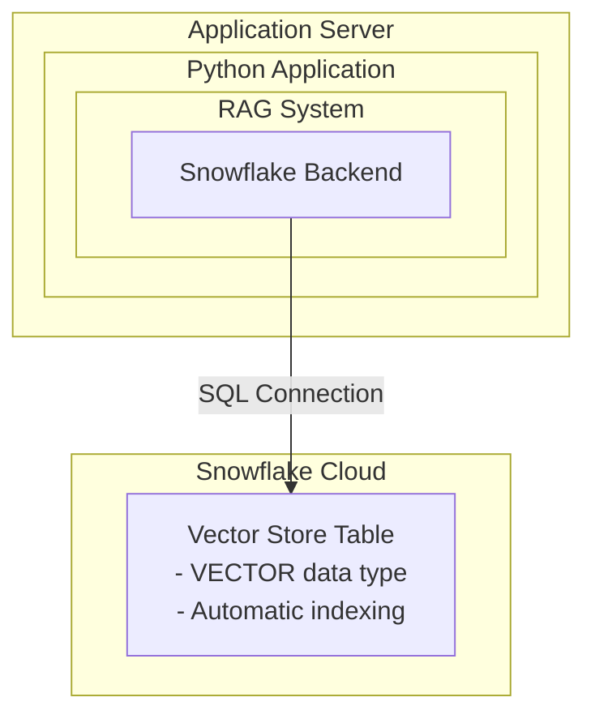
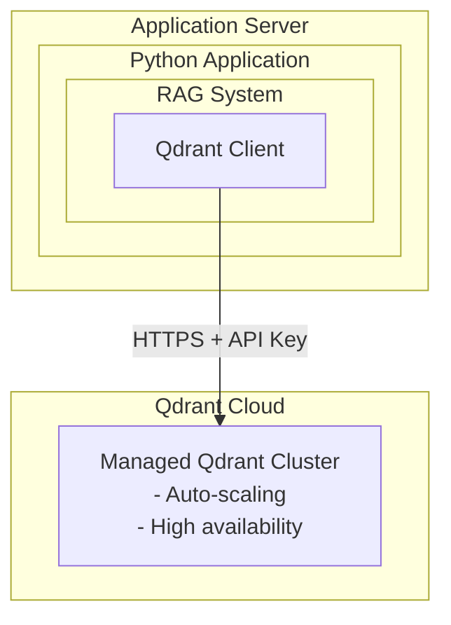

# Multi-Backend Architecture Design

## Executive Summary

This document provides a comprehensive technical architecture for a multi-backend vector database system supporting Retrieval-Augmented Generation (RAG) capabilities. The architecture enables integration with Snowflake, Qdrant, ChromaDB, and FAISS vector stores while maintaining backward compatibility and supporting local-first development workflows.

**Key Architectural Decisions:**

- Abstract interface pattern for vector store and embedding provider abstraction
- Strategy pattern for pluggable backend implementations
- Configuration-driven backend selection
- Local storage support for development and testing
- Unified metadata management via SQLite

## Table of Contents

1. [Overview](#overview)
2. [Design Principles](#design-principles)
3. [System Architecture](#system-architecture)
4. [Component Specifications](#component-specifications)
5. [Database Schemas](#database-schemas)
6. [API/Interface Specifications](#apiinterface-specifications)
7. [Data Flow](#data-flow)
8. [Technology Stack](#technology-stack)
9. [Security Considerations](#security-considerations)
10. [Performance Characteristics](#performance-characteristics)
11. [Scalability Considerations](#scalability-considerations)
12. [Deployment Architecture](#deployment-architecture)
13. [Integration Patterns](#integration-patterns)
14. [Error Handling &amp; Resilience](#error-handling--resilience)
15. [Monitoring &amp; Observability](#monitoring--observability)
16. [Migration Strategy](#migration-strategy)
17. [Testing Strategy](#testing-strategy)
18. [Configuration](#configuration)
19. [Future Considerations](#future-considerations)

## Overview

This architecture supports multiple vector database backends (Snowflake, Qdrant, ChromaDB, FAISS) with local storage capabilities. The system is designed to provide flexibility, testability, and scalability while maintaining backward compatibility with existing Snowflake-only implementations.

**Primary Use Cases:**

- RAG-enhanced report generation for Snowflake Cortex AI model benchmarking
- Knowledge base management with multiple vector store options
- Development and testing with local backends
- Production deployments with cloud-native backends

## Design Principles

1. **Abstraction Layer**: Abstract interfaces for vector stores and embedding providers ensure implementation independence
2. **Strategy Pattern**: Pluggable backends that can be swapped via configuration without code changes
3. **Local-First**: Support local storage for testing and development without cloud dependencies
4. **Backward Compatible**: Existing Snowflake-only code continues to work without modification
5. **Configuration-Driven**: Choose backend via config file or environment variables
6. **SOLID Principles**: Follows Open/Closed and Dependency Inversion principles
7. **Separation of Concerns**: Clear boundaries between storage, embeddings, and business logic

## System Architecture

### High-Level Architecture



### Component Hierarchy



## Component Specifications

### VectorStore Interface

**Abstract Base Class**: `VectorStore`

**Core Methods:**

- `initialize() -> None`: Initialize the vector store (create tables/collections)
- `add_vectors(vectors, texts, metadatas, ids) -> List[str]`: Add vectors to store
- `search(query_vector, top_k, filter) -> List[Dict]`: Search for similar vectors
- `delete(ids) -> bool`: Delete vectors by IDs
- `count() -> int`: Get total number of vectors
- `clear() -> bool`: Clear all vectors from store

### EmbeddingProvider Interface

**Abstract Base Class**: `EmbeddingProvider`

**Core Methods:**

- `embed_text(text) -> List[float]`: Generate embedding for single text
- `embed_batch(texts) -> List[List[float]]`: Generate embeddings for batch
- `dimension -> int`: Get embedding dimension (property)
- `model_name -> str`: Get model name (property)

### Backend Implementations

#### SnowflakeVectorStore

- **Storage**: Snowflake table with VECTOR data type
- **Query**: SQL-based similarity search using VECTOR_DOT_PRODUCT
- **Scalability**: Enterprise-grade, cloud-native
- **Use Case**: Production deployments with Snowflake infrastructure

#### QdrantVectorStore

- **Storage**: Local file system or Qdrant Cloud
- **Query**: Native Qdrant API with HNSW indexing
- **Scalability**: High-performance, supports clustering
- **Use Case**: High-throughput production or local development

#### ChromaDBVectorStore

- **Storage**: Local file system (embedded)
- **Query**: Native ChromaDB API
- **Scalability**: Good for small to medium datasets
- **Use Case**: Development, testing, small-scale production

#### FAISSVectorStore

- **Storage**: Local index files + SQLite metadata
- **Query**: FAISS similarity search (L2 or cosine)
- **Scalability**: Excellent for large-scale similarity search
- **Use Case**: Large-scale local deployments, research

## Database Schemas

### Snowflake Vector Store Schema

```sql
CREATE TABLE IF NOT EXISTS {database}.{schema}.{table_name} (
    id VARCHAR(255) PRIMARY KEY,
    text TEXT,
    embedding VECTOR(FLOAT, {dimension}),
    metadata VARIANT,
    created_at TIMESTAMP_NTZ DEFAULT CURRENT_TIMESTAMP()
);

-- Index for similarity search (Snowflake automatically indexes VECTOR columns)
-- Query example:
-- SELECT id, text, metadata, 
--        VECTOR_DOT_PRODUCT(embedding, :query_vector) AS similarity
-- FROM {table_name}
-- ORDER BY similarity DESC
-- LIMIT :top_k;
```

**Schema Details:**

- `id`: Unique identifier (VARCHAR(255))
- `text`: Document text content (TEXT)
- `embedding`: Vector embedding (VECTOR(FLOAT, dimension))
- `metadata`: JSON metadata (VARIANT)
- `created_at`: Timestamp (TIMESTAMP_NTZ)

### SQLite Metadata Database Schema

```sql
-- Vector Store Configuration Table
CREATE TABLE IF NOT EXISTS vector_store_config (
    id INTEGER PRIMARY KEY AUTOINCREMENT,
    backend TEXT NOT NULL,
    collection_name TEXT NOT NULL,
    dimension INTEGER NOT NULL,
    config_json TEXT,
    created_at TIMESTAMP DEFAULT CURRENT_TIMESTAMP,
    updated_at TIMESTAMP DEFAULT CURRENT_TIMESTAMP,
    UNIQUE(backend, collection_name)
);

-- Document Metadata Table
CREATE TABLE IF NOT EXISTS document_metadata (
    id INTEGER PRIMARY KEY AUTOINCREMENT,
    document_id TEXT UNIQUE NOT NULL,
    source_path TEXT,
    chunk_index INTEGER,
    backend TEXT NOT NULL,
    vector_id TEXT,
    metadata_json TEXT,
    created_at TIMESTAMP DEFAULT CURRENT_TIMESTAMP
);

-- Indexes for Performance
CREATE INDEX IF NOT EXISTS idx_document_metadata_backend 
    ON document_metadata(backend);
CREATE INDEX IF NOT EXISTS idx_document_metadata_source 
    ON document_metadata(source_path);
CREATE INDEX IF NOT EXISTS idx_document_metadata_vector_id 
    ON document_metadata(vector_id);
```

**Schema Details:**

- `vector_store_config`: Stores backend configuration and metadata
- `document_metadata`: Tracks documents across backends, enables cross-backend queries
- Indexes optimize common query patterns

### Qdrant Collection Schema

**Collection Structure:**

```python
{
    "collection_name": "knowledge_base",
    "vectors": {
        "size": 768,  # Dimension
        "distance": "Cosine"  # or "Euclidean", "Dot"
    },
    "payload_schema": {
        "text": "keyword",
        "metadata": "json",
        "source": "keyword",
        "chunk_index": "integer"
    }
}
```

**Storage:**

- Local: `{storage_path}/qdrant/{collection_name}/`
- Cloud: Managed by Qdrant Cloud

### ChromaDB Collection Schema

**Collection Structure:**

```python
{
    "name": "knowledge_base",
    "metadata": {
        "dimension": 768,
        "distance": "cosine"
    },
    "ids": ["doc1", "doc2", ...],
    "embeddings": [[0.1, 0.2, ...], ...],
    "metadatas": [{"text": "...", "source": "..."}, ...],
    "documents": ["text1", "text2", ...]
}
```

**Storage:**

- Local: `{storage_path}/chromadb/{collection_name}/`

### FAISS Index Schema

**Index Structure:**

- **FAISS Index File**: `{index_path}.index` (binary)
- **Metadata Database**: SQLite at `{metadata_path}`

**Metadata Table:**

```sql
CREATE TABLE IF NOT EXISTS faiss_metadata (
    id INTEGER PRIMARY KEY AUTOINCREMENT,
    vector_id TEXT UNIQUE NOT NULL,
    text TEXT,
    metadata_json TEXT,
    index_position INTEGER NOT NULL,
    created_at TIMESTAMP DEFAULT CURRENT_TIMESTAMP
);

CREATE INDEX IF NOT EXISTS idx_faiss_vector_id 
    ON faiss_metadata(vector_id);
CREATE INDEX IF NOT EXISTS idx_faiss_index_position 
    ON faiss_metadata(index_position);
```

**Storage:**

- Index: `{storage_path}/faiss/{index_name}.index`
- Metadata: `{storage_path}/faiss/{index_name}.db`

## API/Interface Specifications

### VectorStore Interface

```python
class VectorStore(ABC):
    """Abstract interface for vector store backends"""
  
    @abstractmethod
    def initialize(self) -> None:
        """
        Initialize the vector store.
        Creates tables/collections if they don't exist.
        Raises: VectorStoreError if initialization fails
        """
        pass
  
    @abstractmethod
    def add_vectors(
        self,
        vectors: List[List[float]],
        texts: List[str],
        metadatas: List[Dict[str, Any]],
        ids: Optional[List[str]] = None
    ) -> List[str]:
        """
        Add vectors to the store.
      
        Args:
            vectors: List of embedding vectors (each is List[float])
            texts: List of text content (same length as vectors)
            metadatas: List of metadata dictionaries
            ids: Optional list of IDs (auto-generated if None)
          
        Returns:
            List of IDs for the added vectors
          
        Raises:
            ValueError: If input lengths don't match
            VectorStoreError: If add operation fails
        """
        pass
  
    @abstractmethod
    def search(
        self,
        query_vector: List[float],
        top_k: int = 5,
        metadata_filter: Optional[Dict[str, Any]] = None
    ) -> List[Dict[str, Any]]:
        """
        Search for similar vectors.
      
        Args:
            query_vector: Query embedding vector
            top_k: Number of results to return
            metadata_filter: Optional metadata filter (backend-specific)
          
        Returns:
            List of results, each with keys:
            - 'id': Vector ID
            - 'text': Text content
            - 'metadata': Metadata dictionary
            - 'score': Similarity score (higher is more similar)
          
        Raises:
            ValueError: If query_vector dimension doesn't match store dimension
            VectorStoreError: If search fails
        """
        pass
  
    @abstractmethod
    def delete(self, ids: List[str]) -> bool:
        """
        Delete vectors by IDs.
      
        Args:
            ids: List of vector IDs to delete
          
        Returns:
            True if successful, False otherwise
          
        Raises:
            VectorStoreError: If delete operation fails
        """
        pass
  
    @abstractmethod
    def count(self) -> int:
        """
        Get total number of vectors in the store.
      
        Returns:
            Total count of vectors
        """
        pass
  
    @abstractmethod
    def clear(self) -> bool:
        """
        Clear all vectors from the store.
      
        Returns:
            True if successful, False otherwise
          
        Raises:
            VectorStoreError: If clear operation fails
        """
        pass
```

### EmbeddingProvider Interface

```python
class EmbeddingProvider(ABC):
    """Abstract interface for embedding providers"""
  
    @abstractmethod
    def embed_text(self, text: str) -> List[float]:
        """
        Generate embedding for a single text.
      
        Args:
            text: Text to embed
          
        Returns:
            Embedding vector as list of floats
          
        Raises:
            EmbeddingError: If embedding generation fails
        """
        pass
  
    @abstractmethod
    def embed_batch(self, texts: List[str]) -> List[List[float]]:
        """
        Generate embeddings for multiple texts (batch processing).
      
        Args:
            texts: List of texts to embed
          
        Returns:
            List of embedding vectors
          
        Raises:
            EmbeddingError: If embedding generation fails
        """
        pass
  
    @property
    @abstractmethod
    def dimension(self) -> int:
        """
        Get the dimension of embeddings produced by this provider.
      
        Returns:
            Embedding dimension (e.g., 768, 1024)
        """
        pass
  
    @property
    @abstractmethod
    def model_name(self) -> str:
        """
        Get the name of the embedding model.
      
        Returns:
            Model name/identifier
        """
        pass
```

## Data Flow

### Document Ingestion Flow



### Query Flow



## Technology Stack

### Core Technologies

- **Python**: 3.9+
- **Snowflake**: Snowpark Python, VECTOR data type
- **Qdrant**: qdrant-client 1.7.0+
- **ChromaDB**: chromadb 0.4.0+
- **FAISS**: faiss-cpu 1.7.4+ (or faiss-gpu)
- **SQLite**: Built-in Python sqlite3

### Embedding Technologies

- **Snowflake**: AI_EMBED function (Cortex AI)
- **OpenAI**: OpenAI API (text-embedding-ada-002, etc.)
- **HuggingFace**: sentence-transformers 2.2.0+
- **Local**: sentence-transformers with PyTorch

### Supporting Libraries

- **LangChain**: Document processing and chunking
- **Pandas**: Data manipulation
- **Python-docx**: Report generation

## Security Considerations

### Authentication & Authorization

- **Snowflake**: Role-based access control (RBAC) via Snowflake session
- **Qdrant Cloud**: API key authentication
- **Local Backends**: File system permissions

### Data Protection

- **Encryption at Rest**:
  - Snowflake: Automatic encryption
  - Local: File system encryption (OS-level)
- **Encryption in Transit**: TLS/SSL for all network communications
- **Sensitive Data**: Metadata should not contain PII without encryption

### Access Control

- **Vector Store Access**: Backend-specific permissions
- **Metadata Database**: SQLite file permissions
- **Configuration Files**: Secure storage of credentials (environment variables preferred)

### Best Practices

- Never commit credentials to version control
- Use environment variables for sensitive configuration
- Implement least-privilege access principles
- Regular security audits of dependencies

## Performance Characteristics

### Backend Performance Comparison

| Backend   | Insert Speed | Query Speed | Memory Usage      | Scalability |
| --------- | ------------ | ----------- | ----------------- | ----------- |
| Snowflake | Medium       | High        | Low (server-side) | Excellent   |
| Qdrant    | High         | Very High   | Medium            | Excellent   |
| ChromaDB  | High         | High        | Low-Medium        | Good        |
| FAISS     | Very High    | Very High   | High              | Excellent   |

### Optimization Strategies

1. **Batch Operations**: Use `embed_batch()` and batch `add_vectors()` for better throughput
2. **Indexing**: Ensure proper indexes on metadata fields
3. **Caching**: Cache embeddings for repeated queries
4. **Connection Pooling**: Reuse connections for Snowflake/Qdrant
5. **Async Operations**: Consider async/await for I/O-bound operations

### Performance Targets

- **Embedding Generation**: < 100ms per document (batch)
- **Vector Search**: < 50ms for top-5 results (10K vectors)
- **Document Ingestion**: > 100 documents/second (batch mode)
- **Query Latency**: < 200ms end-to-end (embed + search + retrieve)

## Scalability Considerations

### Horizontal Scaling

**Snowflake:**

- Automatic scaling via warehouse resizing
- Multi-cluster warehouses for high concurrency
- No application changes required

**Qdrant:**

- Qdrant Cloud: Automatic scaling
- Self-hosted: Cluster mode with sharding

**ChromaDB:**

- Limited horizontal scaling (single-node)
- Best for small to medium datasets

**FAISS:**

- Single-node (high performance)
- For very large datasets, consider sharding

### Vertical Scaling

- **Memory**: FAISS benefits from more RAM
- **CPU**: All backends benefit from more cores
- **Storage**: SSD recommended for local backends

### Data Volume Estimates

| Backend   | Recommended Max Vectors | Notes                              |
| --------- | ----------------------- | ---------------------------------- |
| Snowflake | Unlimited               | Cloud-native, scales automatically |
| Qdrant    | 10M+                    | With proper hardware               |
| ChromaDB  | 1M                      | Single-node limitation             |
| FAISS     | 100M+                   | With sufficient memory             |

## Deployment Architecture

### Development Environment



### Production Environment (Snowflake)



### Production Environment (Qdrant Cloud)



## Integration Patterns

### Factory Pattern

```python
# Backend selection via factory
vector_store = create_vector_store(
    backend="snowflake",  # or "qdrant", "chromadb", "faiss"
    config=rag_config,
    session=snowflake_session  # Required for Snowflake
)

# Embedding provider selection
embedding_provider = create_embedding_provider(
    provider="snowflake",  # or "openai", "local"
    config=rag_config,
    session=snowflake_session  # Required for Snowflake
)
```

### Configuration Pattern

```python
# Configuration-driven initialization
config = RAGConfig()
config.config["backend"] = "qdrant"
config.config["embeddings"]["provider"] = "local"
config.config["embeddings"]["dimension"] = 768

vector_store = create_vector_store(config=config)
```

### Dependency Injection

```python
# Inject dependencies at runtime
rag_system = RAGSystem(
    session=snowflake_session,
    vector_store=vector_store,  # Pre-configured
    embedding_provider=embedding_provider  # Pre-configured
)
```

## Error Handling & Resilience

### Error Types

1. **VectorStoreError**: Base exception for vector store operations
2. **EmbeddingError**: Base exception for embedding generation
3. **ConfigurationError**: Invalid configuration
4. **ConnectionError**: Backend connection failures

### Retry Strategy

```python
# Exponential backoff for transient failures
@retry(
    stop=stop_after_attempt(3),
    wait=wait_exponential(multiplier=1, min=2, max=10)
)
def search_with_retry(vector_store, query_vector, top_k):
    return vector_store.search(query_vector, top_k)
```

### Resilience Patterns

1. **Circuit Breaker**: Prevent cascading failures
2. **Graceful Degradation**: Fallback to simpler operations
3. **Health Checks**: Monitor backend availability
4. **Connection Pooling**: Reuse connections efficiently

## Monitoring & Observability

### Key Metrics

1. **Performance Metrics**:

   - Embedding generation latency
   - Vector search latency
   - Document ingestion throughput
   - Query end-to-end latency
2. **Operational Metrics**:

   - Vector store size (count)
   - Backend health status
   - Error rates by operation type
   - Cache hit rates
3. **Business Metrics**:

   - Documents processed
   - Queries served
   - RAG enhancement quality scores

### Logging Strategy

```python
# Structured logging
logger.info("vector_store_operation", extra={
    "backend": "snowflake",
    "operation": "search",
    "top_k": 5,
    "latency_ms": 45
})
```

### Observability Tools

- **Application Logs**: Python logging module
- **Metrics**: Prometheus-compatible metrics
- **Tracing**: OpenTelemetry for distributed tracing
- **Health Endpoints**: `/health` endpoint for monitoring

## Migration Strategy

### Backend Migration

**Step 1: Export from Source**

```python
source_store = create_vector_store(backend="qdrant")
all_vectors = source_store.search(
    query_vector=[0]*dimension,
    top_k=1000000  # Get all
)
```

**Step 2: Transform Data**

```python
vectors = [r['embedding'] for r in all_vectors]
texts = [r['text'] for r in all_vectors]
metadatas = [r['metadata'] for r in all_vectors]
```

**Step 3: Import to Destination**

```python
dest_store = create_vector_store(backend="snowflake", session=session)
dest_store.initialize()
ids = dest_store.add_vectors(vectors, texts, metadatas)
```

### Version Migration

1. **Schema Evolution**: Handle schema changes gracefully
2. **Data Migration Scripts**: Automated migration utilities
3. **Rollback Plan**: Ability to revert to previous version
4. **Testing**: Validate migrations in staging environment

## Testing Strategy

### Unit Tests

- Test each backend implementation independently
- Mock dependencies (Snowflake session, etc.)
- Test error handling and edge cases

### Integration Tests

- Test backend factory creation
- Test end-to-end document ingestion
- Test cross-backend compatibility

### Performance Tests

- Benchmark each backend
- Load testing with large datasets
- Latency testing under various conditions

### Test Data Management

- Use synthetic data for testing
- Isolated test databases/collections
- Cleanup after tests

## Configuration

### Configuration File (TOML)

```toml
[rag]
backend = "snowflake"  # Options: snowflake, qdrant, chromadb, faiss
local_storage_path = ".datamanagement_genai"

[rag.snowflake]
database = "RAG_KNOWLEDGE_BASE"
schema = "PUBLIC"
table = "VECTOR_STORE"

[rag.qdrant]
path = ".datamanagement_genai/vector_stores/qdrant"
collection_name = "knowledge_base"
url = "http://localhost:6333"  # Optional, for remote Qdrant

[rag.chromadb]
path = ".datamanagement_genai/vector_stores/chromadb"
collection_name = "knowledge_base"

[rag.faiss]
index_path = ".datamanagement_genai/vector_stores/faiss/knowledge_base.index"
metadata_path = ".datamanagement_genai/vector_stores/faiss/knowledge_base.db"
index_type = "L2"  # or "Cosine"

[rag.embeddings]
provider = "snowflake"  # Options: snowflake, openai, huggingface, local
model = "snowflake-arctic-embed-l-v2.0"
dimension = 768
batch_size = 100
```

### Environment Variables

```bash
export RAG_BACKEND=snowflake
export RAG_LOCAL_STORAGE=.datamanagement_genai
export RAG_EMBEDDING_PROVIDER=snowflake
export RAG_EMBEDDING_MODEL=snowflake-arctic-embed-l-v2.0
export RAG_EMBEDDING_DIMENSION=768
```

## Local Storage Structure

```
{project_root}/
├── .datamanagement_genai/          # Local storage directory
│   ├── config.db                   # SQLite config/metadata database
│   ├── vector_stores/              # Vector store data
│   │   ├── qdrant/                 # Qdrant data
│   │   │   └── {collection_name}/
│   │   ├── chromadb/                # ChromaDB data
│   │   │   └── {collection_name}/
│   │   └── faiss/                   # FAISS indices
│   │       ├── {index_name}.index
│   │       └── {index_name}.db
│   └── embeddings/                  # Cached embeddings (optional)
│       └── cache.db
```

## Benefits

✅ **Best Practice**: Follows SOLID principles (Open/Closed, Dependency Inversion)
✅ **Testability**: Easy to mock and test with local backends
✅ **Flexibility**: Users can choose the best backend for their use case
✅ **Cost Efficiency**: Local backends for development/testing
✅ **Scalability**: Can use cloud backends (Snowflake, Qdrant Cloud) for production
✅ **Backward Compatible**: Existing Snowflake code continues to work
✅ **Maintainable**: Clear separation of concerns and interfaces

## Implementation Status

- ✅ Abstract base classes (`VectorStore`, `EmbeddingProvider`)
- ✅ Snowflake backend implementation
- ✅ Qdrant backend implementation
- ✅ ChromaDB backend implementation
- ✅ FAISS backend implementation
- ✅ Local storage manager (SQLite)
- ✅ Factory pattern for backend creation
- ✅ Configuration system (RAGConfig)
- ✅ Integration with RAG system

## Future Considerations

### Planned Enhancements

1. **Additional Backends**:

   - Pinecone integration
   - Weaviate integration
   - Milvus integration
2. **Performance Optimizations**:

   - Async/await support for I/O operations
   - Connection pooling improvements
   - Caching layer for embeddings
3. **Advanced Features**:

   - Multi-tenant support
   - Vector store replication
   - Automatic backend selection based on workload
   - Hybrid search (vector + keyword)
4. **Observability**:

   - OpenTelemetry integration
   - Prometheus metrics export
   - Distributed tracing support
5. **Security**:

   - Encryption at rest for local backends
   - Audit logging
   - Access control policies

## References

- [Snowflake VECTOR Data Type Documentation](https://docs.snowflake.com/en/sql-reference/data-types-semistructured#vector)
- [Qdrant Documentation](https://qdrant.tech/documentation/)
- [ChromaDB Documentation](https://docs.trychroma.com/)
- [FAISS Documentation](https://github.com/facebookresearch/faiss/wiki)
- [LangChain Vector Stores](https://python.langchain.com/docs/modules/data_connection/vectorstores/)

---

**Document Version**: 1.0
**Last Updated**: 2025-01-09
**Author**: Yavin.O
